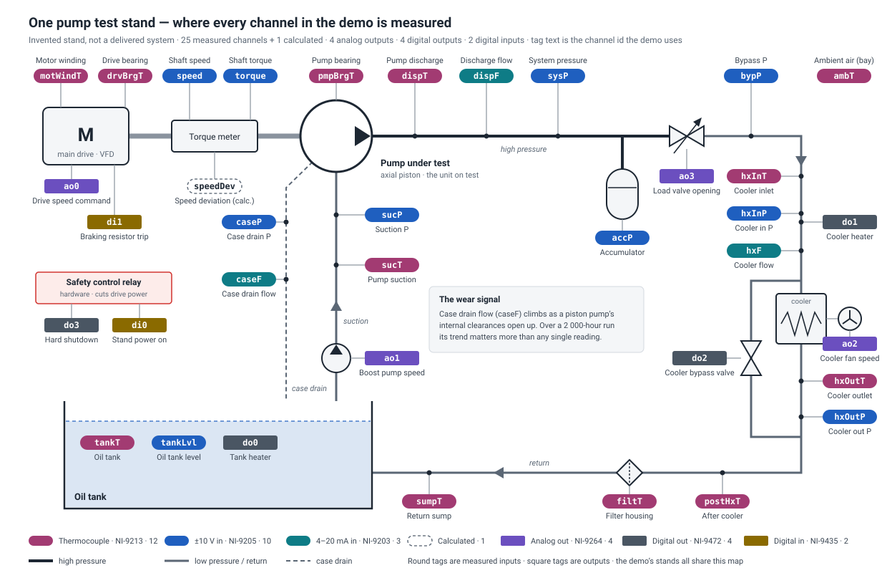
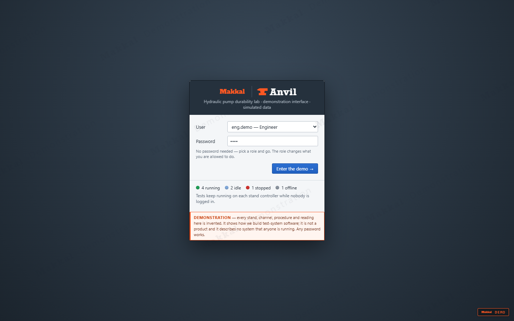
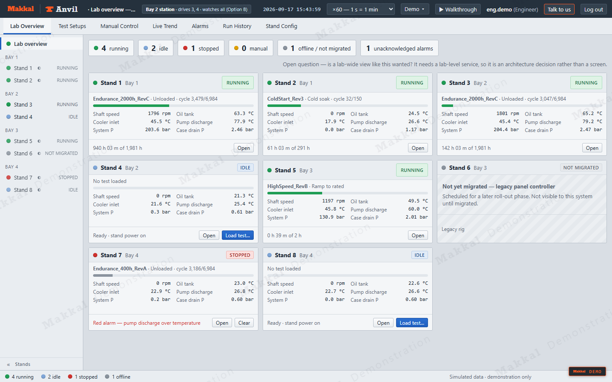
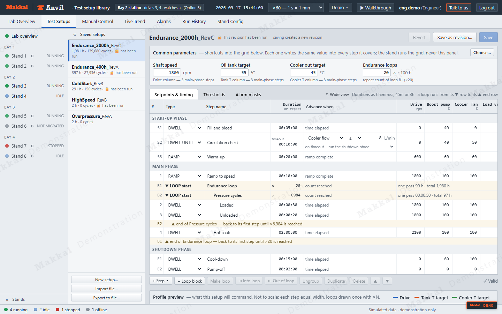
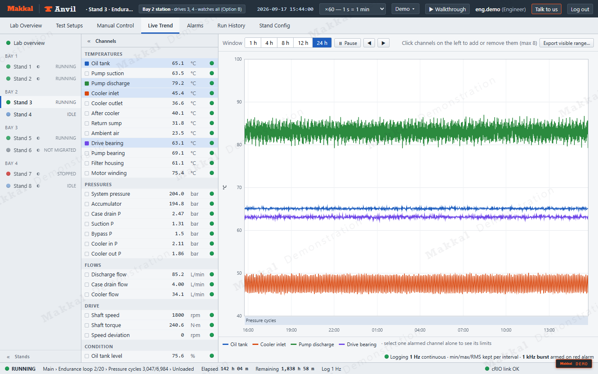
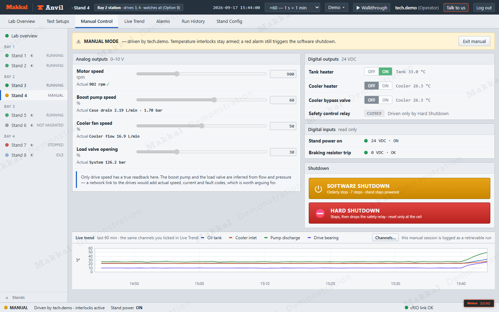
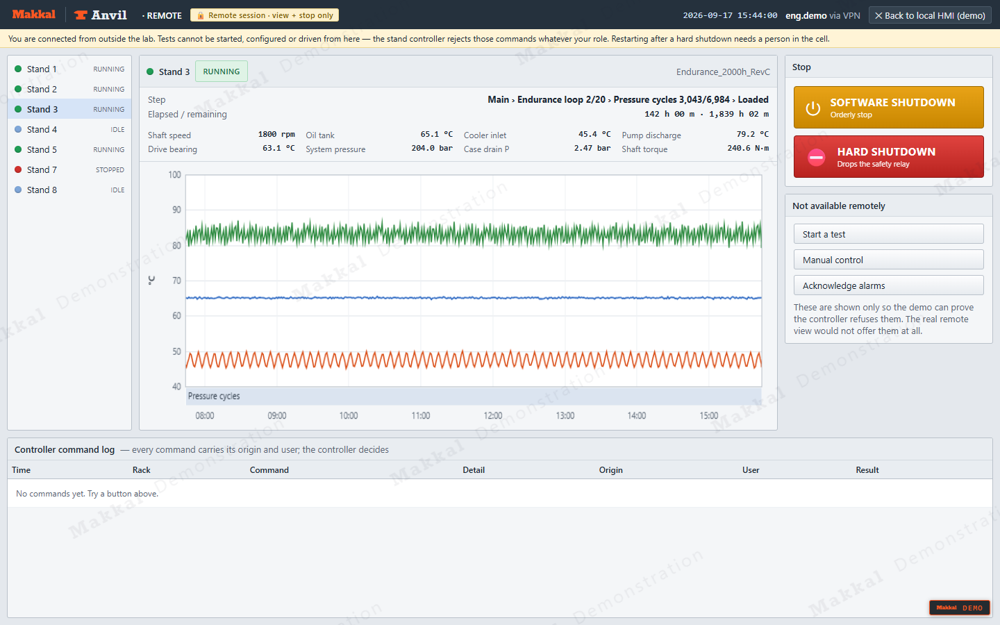
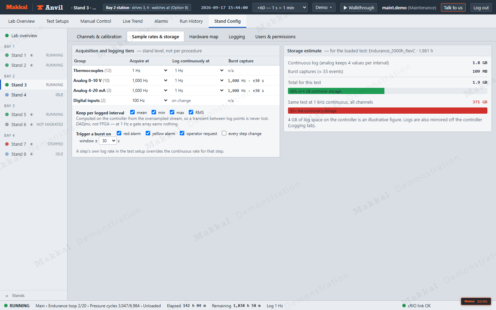
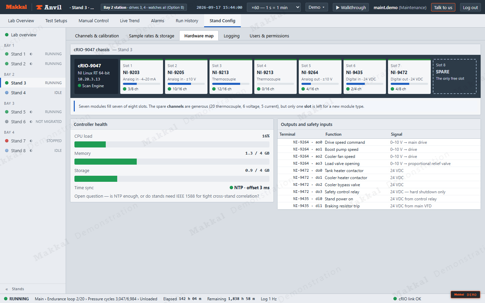
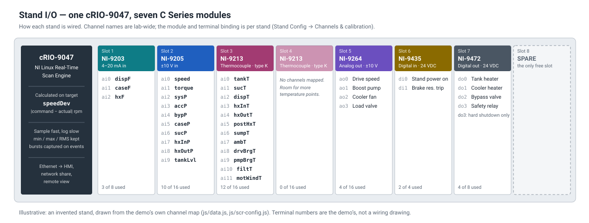

# Anvil — hydraulic pump durability lab

**We build the software that runs test rigs, and hand you the keys.**

[Makkal](https://makkal.co) designs and builds test systems on **NI CompactRIO and CompactDAQ**. That
covers data acquisition, control, safety, logging, the operator HMI and remote visibility, across one
rig or a whole lab. This repository is a working demonstration of that kind of system, built for a
hydraulic pump endurance lab: eight test stands, one of them partway through a 2 000-hour run.

### ▶ [Open the live demo](https://makkal-co.github.io/anvil-pump-durability-demo/)

No install and no sign-up. Pick a role and go. Press **Talk to us** in the header whenever something
looks like your lab.



> **A demonstration, not a delivered system.** The stands, channels, procedures, numbers and people are
> all invented, and the rig behind the screens is a simulation. What is real is the way it is built:
> this is how we structure a test system, and what we would bring to yours.

---

## Is this your lab?

You will recognise at least one of these:

| What you are living with | What a system like this gives you |
|---|---|
| The integrator who wrote the rig software has gone, and nobody can change it | Source code you own, a documented architecture, and no orphaning |
| Every rig is different, and each one needs its own expert | One codebase across the lab, with each rig's differences held in configuration |
| The panel HMI dates from 2009 and its vendor no longer exists | A modern HMI on current NI hardware, reusing your sensors and wiring where it can |
| You cannot see a running test from your desk | Remote visibility that can watch and stop a test but never start one |
| Long endurance runs fill the disk, or miss the event that mattered | Tiered logging: sample fast, log slow, keep min/max/RMS, and capture bursts on events |

---

## Try it in five minutes

1. Open the **[live demo](https://makkal-co.github.io/anvil-pump-durability-demo/)**.
2. Pick a role and press **Enter the demo**. No password is needed. An Operator can drive a stand, an
   Engineer can also edit procedures, and Maintenance can also change stand configuration.
3. Accept the walkthrough. It is short and touches every screen.
4. Then try the four things that matter most in a real lab:
   - **Demo ▾ → inject discharge over-temperature** on Stand 3. Watch the alarm escalate and the
     orderly shutdown step through.
   - **Test Setups** — build an endurance procedure with nested loops, per-step limits and alarm
     masks, and see what its logging will cost in storage before it runs.
   - **Stand Config → Sample rates & storage** — change a rate and watch the storage estimate move.
   - **Demo ▾ → open remote web view** — the same data from outside the lab, with a command set that
     cannot start a test.

| | |
|---|---|
|  **Log in** — any role, no password |  **Lab Overview** — eight stands in four bays, at a glance |
|  **Test Setups** — procedures as configuration, not code |  **Live Trend** — every channel, with the test step on the time axis |
|  **Manual Control** — command beside actual, both shutdown paths |  **Remote view** — watch and stop, never start |
|  **Stand Config** — sample rates, with what they cost in storage |  **Hardware map** — the cRIO chassis, slot by slot |

---

## What sits behind a system like this

The demo shows the screens. In a real lab, most of the value sits underneath them, in the layers we
design and build:

| Layer | What we use | What we decide with you |
|---|---|---|
| **Sensors and rig** | Your thermocouples, transducers, flow meters, torque meter, drives and valves, reused where they are sound | What to measure, where on the rig, and at what accuracy |
| **Measurement I/O** | NI C Series modules for thermocouples, voltage, 4–20 mA, analog out and 24 V digital I/O | Channel count, spare capacity, and calibration scaling kept per stand |
| **Real-time control** | **NI CompactRIO** running **LabVIEW Real-Time**, on Scan Engine or DAQmx, with FPGA only where the rate earns it. **NI CompactDAQ** where a PC-based rig is the better fit | Loop rates, interlocks, what happens when a step times out, and the orderly shutdown |
| **Safety** | A hardwired safety relay that cuts power on its own | What hardware protects, and what software only reports |
| **Data** | Tiered logging on the controller, mirrored to a network share | Rates per channel group, what counts as an event, and how long data is kept |
| **Operator HMI** | Procedure editor, live trends, alarms, manual control, run history | Roles and permissions, and who may change what |
| **Remote and integration** | A web front end that does not depend on NI, plus links to drives, PLCs and plant systems over the protocols they already use | Who can see the lab from outside, and what they are allowed to do |

On the demo's stand, that comes to one cRIO-9047 with seven C Series modules:



---

## The stand in the demo

Every stand in the demo is the same invented rig. An electric drive turns an axial-piston pump
through a torque meter. A boost pump feeds the pump's suction, and a proportional relief valve loads
its discharge, where an accumulator also sits. The return oil runs through a cooler with a fan, a
heater and a bypass, then a filter, and back to a heated tank. The case drain goes straight to the
tank, and its flow is the wear signal the endurance procedures watch.

The schematic at the top of this page shows where each channel is measured.

### Measured channels (26)

| Group | Id | Name | Unit | Module · terminal | Range |
|---|---|---|---|---|---|
| Temperatures | `tankT` | Oil tank | °C | NI-9213 · ai0 | type K |
| | `sucT` | Pump suction | °C | NI-9213 · ai1 | type K |
| | `dispT` | Pump discharge | °C | NI-9213 · ai2 | type K |
| | `hxInT` | Cooler inlet | °C | NI-9213 · ai3 | type K |
| | `hxOutT` | Cooler outlet | °C | NI-9213 · ai4 | type K |
| | `postHxT` | After cooler | °C | NI-9213 · ai5 | type K |
| | `sumpT` | Return sump | °C | NI-9213 · ai6 | type K |
| | `ambT` | Ambient air | °C | NI-9213 · ai7 | type K |
| | `drvBrgT` | Drive bearing | °C | NI-9213 · ai8 | type K |
| | `pmpBrgT` | Pump bearing | °C | NI-9213 · ai9 | type K |
| | `filtT` | Filter housing | °C | NI-9213 · ai10 | type K |
| | `motWindT` | Motor winding | °C | NI-9213 · ai11 | type K |
| Pressures | `sysP` | System pressure | bar | NI-9205 · ai2 | 0–400 |
| | `accP` | Accumulator | bar | NI-9205 · ai3 | 0–400 |
| | `bypP` | Bypass P | bar | NI-9205 · ai4 | 0–400 |
| | `caseP` | Case drain P | bar | NI-9205 · ai5 | 0–10 |
| | `sucP` | Suction P | bar | NI-9205 · ai6 | 0–5 |
| | `hxInP` | Cooler in P | bar | NI-9205 · ai7 | 0–6 |
| | `hxOutP` | Cooler out P | bar | NI-9205 · ai8 | 0–6 |
| Flows | `dispF` | Discharge flow | L/min | NI-9203 · ai0 | 0–150 |
| | `caseF` | Case drain flow | L/min | NI-9203 · ai1 | 0–15 |
| | `hxF` | Cooler flow | L/min | NI-9203 · ai2 | 0–60 |
| Drive | `speed` | Shaft speed | rpm | NI-9205 · ai0 | 0–3 000 |
| | `torque` | Shaft torque | N·m | NI-9205 · ai1 | 0–600 |
| | `speedDev` | Speed deviation | rpm | calculated: \|command − actual\| | 0–3 000 |
| Condition | `tankLvl` | Oil tank level | % | NI-9205 · ai9 | 0–100 |

A channel's id is the name that procedures, limits and exported files refer to, and it is the same
on every stand. Only the module and terminal binding belongs to a particular stand, so adding a stand
means a wiring table and a calibration sheet, not a code change.

### Outputs and digital inputs

| Terminal | Signal | Drives |
|---|---|---|
| NI-9264 · ao0 | Drive speed command | Main drive VFD, 0–10 V |
| NI-9264 · ao1 | Boost pump speed | Boost pump drive, 0–10 V |
| NI-9264 · ao2 | Cooler fan speed | Fan drive, 0–10 V |
| NI-9264 · ao3 | Load valve opening | Proportional relief valve, 0–10 V |
| NI-9472 · do0 | Tank heater | Contactor, 24 VDC |
| NI-9472 · do1 | Cooler heater | Contactor, 24 VDC |
| NI-9472 · do2 | Cooler bypass valve | Solenoid, 24 VDC |
| NI-9472 · do3 | Safety control relay | Hard shutdown only |
| NI-9435 · di0 | Stand power on | From the safety control relay |
| NI-9435 · di1 | Braking resistor trip | From the main VFD |

---

## How we work together

1. **A conversation about your rig.** Tell us what you test, what runs it today, and what hurts. We
   bring the twenty questions below, since most test specifications leave them unanswered.
2. **The specification, written together.** Channels, rates, procedures, alarms, safety and data,
   agreed on paper before any code is written.
3. **Start with one or two rigs.** Modernise them on NI CompactRIO or CompactDAQ, reusing your sensors
   and wiring where they are sound, then roll the result out to the rest of the lab.
4. **Commissioning on your rig.** Tested against your hardware with your technicians, not signed off
   on a bench.
5. **Handover.** You own the source, the documentation and the architecture. If we disappeared
   tomorrow, your next engineer could carry on.

The principles we hold throughout:

- **Safety belongs in hardware.** Software runs the orderly shutdown; it is never the last line of
  defence.
- **Configuration over code.** Technicians edit procedures and stands, not programs.
- **Log for the event you cannot predict.** Tiered rates, statistics per interval, and bursts on
  alarms.
- **You own the source.**

## Twenty questions your specification does not answer

**[docs/questions.md](docs/questions.md)** lists the twenty questions we end up asking on every
test-system project. They cover when a dwell actually starts, what a conditional step does when it
times out, whether case drain flow is judged against a limit or against its own trend, and who may
switch an alarm off. Most of them change the design. Read them before you write your next
specification, or send them to us with your answers.

## Talk to us

If your lab has one of the problems above, we would like to hear about it. To help us come back to
you with something useful, tell us:

- what you test (the unit, and the kind of test: endurance, performance, end-of-line)
- what runs the rigs today (PLC and panel HMI, LabVIEW, bespoke software, or nothing yet)
- roughly how many rigs you have and how many channels each one carries
- what is hurting most

**Email [support@makkal.co](mailto:support@makkal.co)**, press **Talk to us** inside the
[demo](https://makkal-co.github.io/anvil-pump-durability-demo/), or visit **[makkal.co](https://makkal.co)**.

---

## What this demo does not model

Stated plainly, because a demonstration that overclaims is worse than none:

- **Conditional steps are not evaluated.** The simulator advances every step on time, including
  `DWELL UNTIL`. The condition and its timeout action are edited, saved and exported correctly, but
  the rig never tests them.
- **No cycle counter** that survives a restart.
- Step timing runs from step entry, not from a settled condition.
- The physics is plausible, not accurate. It exists so the screens have something to show.
- Nothing is persisted. Reloading the page resets everything.

## About the demo itself

The demo is plain HTML, CSS and JavaScript, with no framework, no build step and no network calls.
It runs from `file://` as happily as from a web server, because the labs these systems run in often
have no internet at all. It is a stand-in for the operator HMI layer; in a delivered system the same
screens talk to the controller on the stand.

```
index.html        frame, login, SVG symbols
docs/             the question set, the stand schematic, the I/O map and screenshots
css/              styling
js/data.js        channels, limits, stands, procedures  — the domain lives here
js/sim.js         the plant model
js/scr-*.js       one file per screen
```

Deep links for rehearsing a demo:

```
index.html#user=eng.demo&screen=setups&tab=th
index.html#user=tech.demo&screen=manual&rack=4
index.html#user=eng.demo&screen=graph&rack=3
```

To check a change without clicking through it:

```
chrome --headless=new --screenshot=shot.png --virtual-time-budget=3000 \
  "file:///path/to/index.html#user=eng.demo&screen=setups"
```

Script errors render as a red banner at the top of the page.

---

*[Makkal](https://makkal.co) builds test-system software (DAQ, control, HMI and data), mostly on NI
CompactRIO and CompactDAQ. Demonstration interface. Simulated data. Not a product.*
